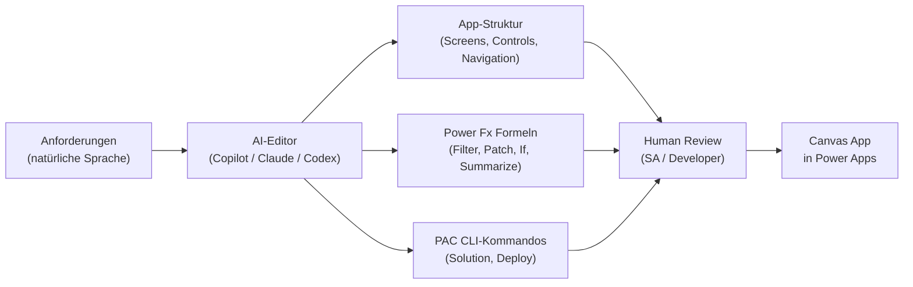

# Theorie: Canvas Apps mit AI im Editor bauen

<details>
<summary>🎯 Einstiegsfragen — vor der Erklärung stellen</summary>

1. Was ist der Unterschied zwischen KI als Feature in einer App und KI als Builder der App?
2. Welche Teile einer Canvas App kann ein AI-Editor sinnvoll generieren — welche nicht?
3. Was passiert wenn du einen generierten Power Fx-Ausdruck blind übernimmst?

<details>
<summary>💡 Musterlösung</summary>

**1.** KI als Feature: AI Builder in der App, Copilot Chat eingebettet — der Nutzer interagiert mit KI. KI als Builder: GitHub Copilot, Claude Code, Codex generieren die App selbst — der Entwickler interagiert mit KI. Dieses Modul behandelt ausschließlich KI als Builder.

**2.** Sinnvoll generierbar: Screen-Struktur, Control-Namen, Power Fx-Formeln für Filter/Patch/If, Navigation, Offline-Patterns, PAC CLI-Kommandos. Nicht generierbar ohne Review: Berechtigungen, Row-Level Security, Validierungslogik mit fachlichen Ausnahmen, Lizenzentscheidungen.

**3.** Generierte Formeln sind syntaktisch meist korrekt aber semantisch riskant — z.B. ein `Patch()` ohne Error-Handling, ein `Filter()` ohne Delegation-Warning zu beachten. Jede Formel muss auf Delegation, Performance und Security geprüft werden.

</details>
</details>

## Das Konzept: AI als Builder

Statt eine Canvas App manuell Screen für Screen aufzubauen, nutzt du AI-Editoren als ersten Entwurfs-Generator:



Der AI-Editor übernimmt den **ersten Entwurf** — der Mensch übernimmt **Architektur, Sicherheit und fachliche Korrektheit**.

## Die drei AI-Tools im Vergleich

| Tool                         | Stärke                                            | Schwäche                            | Ideal für                                    |
| ---------------------------- | ------------------------------------------------- | ----------------------------------- | -------------------------------------------- |
| **GitHub Copilot** (VS Code) | Workspace-Kontext, inline Vervollständigung       | Kein direktes Power Apps-Deployment | `.pa.yaml`, PAC CLI-Scripts, Dokumentation   |
| **Claude Code** (Terminal)   | Große Kontextfenster, komplexe Reasoning-Aufgaben | Kein IDE-Integration                | Architekturanalyse, große Refactorings, ADRs |
| **Codex CLI** (OpenAI)       | Schnell, API-direkt nutzbar                       | Weniger Kontext über Workspace      | Einmalige Formel-Generierung, Snippets       |

Alle drei können mit einer guten `copilot-instructions.md` / `CLAUDE.md` auf den Projektkontext ausgerichtet werden.

## Power Apps Source Format (.pa.yaml)

Canvas Apps können als YAML-Quelltext verwaltet werden — das ist das Format das AI-Editoren generieren:

```bash
# Canvas App zu YAML exportieren
pac canvas unpack --msapp VisitTrack.msapp --sources ./src

# Struktur nach Export:
src/
  VisitListScreen.fx.yaml   # Screen als YAML
  VisitDetailScreen.fx.yaml
  App.fx.yaml               # App-Ebene (OnStart, Themes)
  DataSources/
    vt_visits.json          # Dataverse Connector-Konfiguration
```

**Beispiel: Screen als YAML (generiert durch Copilot)**

```yaml
# VisitListScreen.fx.yaml
As: screen

Fill: =RGBA(248, 249, 250, 1)

galVisits As gallery:
  Items: =Filter(vt_visits, vt_owner = User().Email)
  Layout: =Layout.Vertical
  TemplateSize: =80

  lblPhysicianName As label:
    Text: =ThisItem.vt_physician_name
    FontSize: =16

  lblVisitDate As label:
    Text: =Text(ThisItem.vt_visit_date, "[$-de-DE]DD.MM.YYYY")
    FontSize: =12

btnNewVisit As button:
  Text: ="+ Neuer Besuch"
  OnSelect: =Navigate(VisitDetailScreen, ScreenTransition.Slide)
```

Dieses YAML kann Copilot generieren — der SA prüft Delegation, Sicherheit und Konventionen.

## Prompt-Muster für Canvas App Generierung

### Screen-Struktur generieren

```
Prompt an Copilot / Claude:

"Ich baue eine Canvas App für VisitTrack (MedPharma).
 Zielgruppe: Außendienstmitarbeiter auf Mobilgeräten.
 Datenquelle: Dataverse, Tabellen vt_visits und vt_physicians.

 Generiere die YAML-Struktur für einen VisitListScreen:
 - Gallery mit Besuchen des aktuellen Nutzers (gefiltert nach Owner)
 - Je Visit: Arztname, Datum, Dauer in Minuten
 - Button 'Neuer Besuch' → navigiert zu VisitDetailScreen
 - Offline-Banner wenn Connection.Connected = false

 Konventionen: gbl/loc/col Variablen, btnX/lblX/galX Control-Namen, vt_ Präfix
 Output: .pa.yaml Format"
```

### Power Fx Formeln generieren

```
Prompt:

"Schreibe die Power Fx OnSelect-Formel für einen 'Besuch speichern' Button.
 Anforderungen:
 - Validierung: Arzt muss ausgewählt sein, Datum darf nicht in der Zukunft liegen
 - Patch() in vt_visits mit den Formularfeldern
 - Fehlerhandling: Notify() bei Fehler, Navigate() bei Erfolg
 - Offline: auch ohne Verbindung in lokale Collection speichern

 Dataverse-Tabelle: vt_visits
 Felder: vt_physician_id (Lookup), vt_visit_date (Date), vt_duration (Number), vt_notes (Text)
 Output: kommentierten Power Fx Code"
```

### PAC CLI-Script generieren

```
Prompt:

"Generiere ein PowerShell-Script das:
 1. PAC CLI Auth gegen DEV-Environment aufbaut
 2. Solution 'VisitTrack' exportiert (Unmanaged)
 3. Als Managed Solution in TEST importiert
 4. Fehler abbricht (ErrorActionPreference Stop)

 Variablen: $DEV_ENV, $TEST_ENV als Parameter
 Publisher: medpharma, Solution: VisitTrack
 Output: kommentiertes PowerShell-Script"
```

## CLAUDE.md — Kontext für Claude Code

Claude Code liest eine `CLAUDE.md` Datei im Workspace-Root analog zu `copilot-instructions.md`:

```markdown
# CLAUDE.md — VisitTrack Power Platform Project

## Project

Canvas App for field reps (ADMs) at MedPharma GmbH.
Stack: Power Apps Canvas, Dataverse, Power Automate, PAC CLI.

## Conventions

- Table prefix: vt\_ (publisher: medpharma)
- Power Fx: gbl* globals, loc* locals, col\* collections
- Controls: btnX, lblX, galX, frmX, txtX
- Diagrams: Mermaid only

## Key Tables

- vt_visits: visit records (owner-based RLS)
- vt_physicians: physician master data (read for all)
- vt_users: ADM profiles (linked to systemuser)

## What Claude should NOT do

- Deploy directly to production
- Write RLS rules without asking for review
- Assume online connectivity (offline patterns required)
```

## Was prüfen — was blind übernehmen?

```
✓ Blind übernehmen (nach kurzer Sichtprüfung):
  - Screen-Namen und Control-Benennung nach Konvention
  - Navigations-Logik zwischen Screens
  - Text-Formatierungen (Datum, Zahl)
  - PAC CLI-Syntax für bekannte Kommandos

⚠ Immer prüfen:
  - Filter()-Formeln: Delegation-Warning in Power Apps prüfen
  - Patch()-Formeln: Pflichtfelder und Error-Handling vollständig?
  - LookUp(): Was passiert wenn kein Ergebnis?
  - Connection.Connected: Offline-Zweig korrekt implementiert?

✗ Nie blind übernehmen:
  - Sicherheitsrollen und Row-Level Security
  - Production-Deployments ohne manuelle Review
  - Validierungslogik mit fachlichen Ausnahmen
  - Lizenz- und Kostenentscheidungen
```
