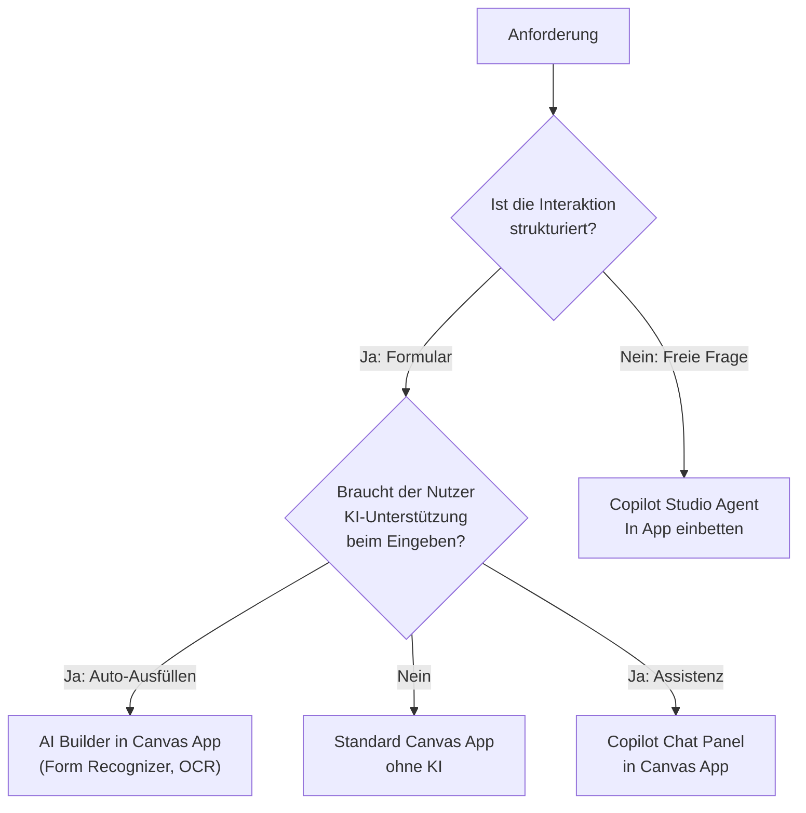

# Theorie: Canvas Apps mit KI

<details>
<summary>🎯 Einstiegsfragen — vor der Erklärung stellen</summary>

1. Was ist der Unterschied zwischen AI Builder und Copilot in Canvas Apps?
2. Wann ist es besser, einen Copilot Studio Agent zu nutzen statt KI direkt in einer Canvas App?
3. Was sind die Kosten-Implikationen von AI Builder in einer Canvas App?

<details>
<summary>💡 Musterlösung</summary>

**1.** AI Builder ist ein Satz trainierter Modelle für strukturierte Aufgaben (Formularextraktion, Objekterkennung, Sentimentanalyse) — aufrufbar als Power Fx-Funktion. Copilot in Canvas ist der eingebettete Chat-Assistent (Copilot Studio Agent) der in eine Canvas App integriert wird. AI Builder ist für automatisierte Verarbeitung, Copilot für interaktive Dialoge.

**2.** Canvas App wenn: strukturierte Dateneingabe, viele Felder, Validierungsregeln, der Nutzer braucht eine klare Oberfläche. Copilot Studio Agent wenn: freie Sprachinteraktion, Questions & Answers, der Nutzer weiß nicht was er eingeben soll.

**3.** AI Builder nutzt AI Credits (separat von Power Platform Lizenzen). Pro Seite Dokumentenverarbeitung ca. 1 Credit. 1 Million Credits kostet ca. 500 €. Muss pro Umgebung separat zugeteilt werden.

</details>
</details>

## AI Builder — Strukturierte KI-Funktionen

AI Builder stellt vortrainierte Modelle als Power Fx-Funktionen bereit:

```
// Dokument verarbeiten (Rechnung, Formular, ID)
AIFormRecognizer.Predict(uploadedFile)
→ { fields: { invoice_number, total_amount, vendor_name, ... } }

// Objekte in Bild erkennen
AIObjectDetector.Predict(cameraPhoto)
→ { objects: [{ label: "Medikament X", confidence: 0.97, boundingBox: ... }] }

// Text analysieren
AISentimentAnalysis.Predict(reviewText)
→ { sentiment: "positive", confidence: 0.89 }

// Eigenes Custom Model (trainiert auf eigene Daten)
MyCustomClassifier.Predict(inputText)
→ { label: "Kategorie A", confidence: 0.91 }
```

**Typische Use Cases in VisitTrack:**

| Use Case                          | AI Builder Funktion               | Einsparung                       |
| --------------------------------- | --------------------------------- | -------------------------------- |
| ADM fotografiert Arztvisitenkarte | Object Detector + Form Recognizer | Arzt manuell eintippen entfällt  |
| ADM scannt Rezept/Dokument        | Document Processing               | Strukturierte Daten ohne Eingabe |
| Manager bewertet Besuchsnotizen   | Sentiment Analysis                | Früherkennung von Problemen      |

## Copilot in Canvas App integrieren

Ab Power Apps 2024 kann ein Copilot Studio Agent direkt in eine Canvas App eingebettet werden:

```
// Canvas App Struktur mit eingebettetem Copilot
Screen: VisitDashboard
├── Gallery: Visit List (links)
│   └── Items: Filter(vt_visits, owner = User())
├── Details Panel (Mitte)
│   └── Form: Visit Details
└── Copilot Chat Panel (rechts)
    └── Component: CopilotChat
        ├── Agent: "VisitTrack Assistant"
        └── Context: {selected_visit: Gallery.Selected}
```

Der eingebettete Agent bekommt den App-Kontext übergeben — er weiß welcher Besuch gerade ausgewählt ist:

```powerfx
// Context an Copilot übergeben
CopilotChat.Send({
    message: "Analysiere diesen Besuch",
    context: {
        visit_id: Gallery1.Selected.visit_id,
        physician_name: Gallery1.Selected.physician_name,
        notes: Gallery1.Selected.notes
    }
})
```

## Power Fx KI-Funktionen (2024+)

Power Apps hat native AI-Funktionen direkt in Power Fx:

```powerfx
// Text generieren
Set(visitSummary,
    Summarize(visitNotes, "Fasse in 2 Sätzen zusammen")
)

// Klassifizieren
Set(visitCategory,
    Classify(visitNotes, ["Produktpräsentation", "Reklamation", "Nachfolge", "Erstbesuch"])
)

// Entitäten extrahieren
Set(extractedData,
    Extract(scannedText, {date: "Datum des Besuchs", duration: "Dauer"})
)

// Antwort auf Frage generieren (RAG-ähnlich)
Set(answer,
    Ask(userQuestion, Filter(vt_documents, category = "compliance"))
)
```

**Wichtig:** Diese Funktionen sind async — immer mit `ClearCollect` + `Loading`-State kombinieren.

## Beispiel: Visitenkarten-Scanner

```powerfx
// Screen: NewPhysician
// Button: "Visitenkarte scannen"

OnSelect =
    // 1. Kamera öffnen oder Foto nehmen
    Set(capturedPhoto, Camera1.Photo);

    // 2. AI Builder Form Recognizer aufrufen
    Set(
        cardData,
        AIFormRecognizer.Predict(capturedPhoto, "business-card-model")
    );

    // 3. Felder befüllen
    Set(newPhysicianName, cardData.fields.name.value);
    Set(newPhysicianPhone, cardData.fields.phone.value);
    Set(newPhysicianEmail, cardData.fields.email.value);
    Set(newPhysicianAddress, cardData.fields.address.value);

    // 4. Zur Bestätigungs-Ansicht navigieren
    Navigate(ConfirmPhysicianScreen, ScreenTransition.Slide)
```

Der Nutzer fotografiert eine Visitenkarte → alle Felder sind vorausgefüllt → er prüft und speichert.

## Architekturentscheidung: KI in App vs. Agent



## Offline-Kompatibilität beachten

AI Builder-Aufrufe und Copilot sind **nicht offline-fähig**.

Für VisitTrack (Offline-Anforderung):

```
Offline-kompatibel:
  ✓ Besuch erfassen (Canvas + Dataverse Offline)
  ✓ Arzt-Daten lesen (aus lokalem Cache)

Nicht Offline-kompatibel:
  ✗ Visitenkarte scannen (AI Builder braucht Cloud)
  ✗ Copilot Chat (Agent braucht Cloud)

Lösung: Graceful Degradation
  IF Connection.Connected:
    SHOW CameraScanner + CopilotPanel
  ELSE:
    HIDE CameraScanner + CopilotPanel
    SHOW: "Offline-Modus: KI-Funktionen nicht verfügbar"
```
