# Theorie: Agentic Deployment — Agents als Code deployen

<details>
<summary>🎯 Einstiegsfragen — vor der Erklärung stellen</summary>

1. Was ist das Problem wenn man Agents manuell deployed?
2. Was ist der Unterschied zwischen einem `agents.md` und einer CI/CD Pipeline?
3. Wie testest du einen Agent automatisiert?

<details>
<summary>💡 Musterlösung</summary>

**1.** Kein Audit-Trail, keine Reproduzierbarkeit, kein Rollback. Wenn der Agent in Prod falsch konfiguriert ist, weiß man nicht wann und wie er geändert wurde. Manuelles Deployment skaliert nicht wenn mehrere Agents über mehrere Umgebungen deployed werden müssen.

**2.** `agents.md` definiert was die Agents tun und welche MCPs sie nutzen — es ist die Konfiguration als Code. Eine CI/CD Pipeline automatisiert den Prozess, diese Konfiguration in Ziel-Umgebungen zu deployen, zu testen und zu verifizieren.

**3.** Automatisiertes Agent Testing: Vordefinierte Input-Output-Paare testen (Unit Tests für Conversations), Tool-Aufrufe mocken und prüfen ob der Agent die richtigen Tools mit den richtigen Parametern aufruft, End-to-End Tests mit simulierten Nutzergesprächen.

</details>
</details>

## Agents.md — Konfiguration als Code

`agents.md` ist eine Konvention (aus GitHub Copilot / Anthropic Ökosystem) die Agent-Konfiguration als Markdown-Datei im Repository speichert. VS Code Agent Mode liest diese Datei und richtet die Agents automatisch ein.

```markdown
# agents.md — VisitTrack AI System

## Agents

### visittrack-assistant

- **Modell:** claude-3-5-sonnet
- **System Prompt:** Du bist VisitTrack-Assistent für ADMs der MedPharma GmbH.
  Hilf bei Besuchserfassung, Arzt-Lookup und Performance-Analyse.
- **MCP Servers:**
  - `visittrack-dataverse` (Dataverse Read/Write)
  - `visittrack-sharepoint` (SharePoint Read-Only)
- **Tools erlaubt:** get_visits, get_physician, create_visit
- **Tools verboten:** delete_record, export_all_data

### visittrack-architect

- **Modell:** claude-3-5-sonnet
- **System Prompt:** Du bist Solution Architecture Assistant.
  Analysiere Anforderungen und generiere Architektur-Vorschläge für Power Platform.
- **MCP Servers:**
  - `visittrack-dataverse` (Read-Only)
  - `architecture-kb` (Best Practices Knowledge Base)
- **Tools erlaubt:** get_schema, analyze_requirements, suggest_architecture

## MCP Server Konfiguration

### visittrack-dataverse

- **Typ:** stdio
- **Command:** `node ./mcp-servers/dataverse/dist/index.js`
- **Umgebungsvariablen:**
  - `DATAVERSE_URL` → aus `.env`
  - `TENANT_ID` → aus `.env`

### visittrack-sharepoint

- **Typ:** stdio
- **Command:** `node ./mcp-servers/sharepoint/dist/index.js`
- **Umgebungsvariablen:**
  - `SHAREPOINT_SITE_URL` → aus `.env`
```

## CI/CD Pipeline für Agents

```mermaid
flowchart LR
    DEV["Developer\npusht Code"] --> GIT["GitHub\nRepository"]
    GIT --> CI["CI Pipeline\n(GitHub Actions)"]
    CI --> TEST["Agent Tests\n(mockte MCPs)"]
    TEST -->|Passed| DEPLOY_TEST["Deploy → Test-Umgebung\n(pac solution import)"]
    DEPLOY_TEST --> INT_TEST["Integration Tests\n(echte Dataverse)"]
    INT_TEST -->|Passed| APPROVE["Manual Approval\n(SA Review)"]
    APPROVE --> DEPLOY_PROD["Deploy → Production\n(pac solution import)"]
    DEPLOY_PROD --> MONITOR["Monitoring\n(Agent Telemetry)"]
```



## GitHub Actions Workflow

```yaml
# .github/workflows/deploy-agents.yml
name: Deploy VisitTrack Agents

on:
  push:
    branches: [main]
    paths:
      - "mcp-servers/**"
      - "agents.md"
      - "solution/**"

jobs:
  test:
    runs-on: ubuntu-latest
    steps:
      - uses: actions/checkout@v4

      - name: Install dependencies
        run: npm ci

      - name: Run MCP Server Unit Tests
        run: npm test -- --coverage

      - name: Run Agent Conversation Tests
        run: npm run test:agent
        env:
          ANTHROPIC_API_KEY: ${{ secrets.ANTHROPIC_API_KEY }}

  deploy-test:
    needs: test
    runs-on: ubuntu-latest
    steps:
      - uses: actions/checkout@v4

      - name: Install PAC CLI
        run: npm install -g @microsoft/powerplatform-cli

      - name: Deploy to Test Environment
        run: |
          pac auth create \
            --environment ${{ vars.TEST_ENV_URL }} \
            --applicationId ${{ secrets.APP_ID }} \
            --clientSecret ${{ secrets.CLIENT_SECRET }} \
            --tenant ${{ secrets.TENANT_ID }}

          pac solution import \
            --path ./solution/VisitTrack_managed.zip \
            --environment ${{ vars.TEST_ENV_URL }}

      - name: Run Integration Tests
        run: npm run test:integration
        env:
          DATAVERSE_URL: ${{ vars.TEST_ENV_URL }}

  deploy-prod:
    needs: deploy-test
    runs-on: ubuntu-latest
    environment: production # Erfordert manuelles Approve in GitHub
    steps:
      - uses: actions/checkout@v4

      - name: Deploy to Production
        run: |
          pac solution import \
            --path ./solution/VisitTrack_managed.zip \
            --environment ${{ vars.PROD_ENV_URL }}
```

## Agent Testing Framework

```typescript
// tests/agent.test.ts
import { describe, it, expect } from "vitest";
import { createMockMcpServer } from "./mocks/mcp-server";

describe("VisitTrack Assistant", () => {
  it("calls get_visits tool when asked for today's visits", async () => {
    const mockMcp = createMockMcpServer({
      get_visits: () => [
        { id: "v-001", visit_date: "today", physician_name: "Dr. Mueller" },
      ],
    });

    const agent = new VisitTrackAgent({ mcp: mockMcp });
    const response = await agent.chat("Was habe ich heute?");

    expect(mockMcp.callCount("get_visits")).toBe(1);
    expect(mockMcp.lastCallArgs("get_visits")).toMatchObject({
      date_from: expect.stringContaining(
        new Date().toISOString().split("T")[0]
      ),
    });
    expect(response).toContain("Dr. Mueller");
  });

  it("refuses to delete records", async () => {
    const agent = new VisitTrackAgent();
    const response = await agent.chat("Lösche alle Besuche von letztem Monat");

    expect(response).toContain("nicht berechtigt");
    expect(response).not.toContain("gelöscht");
  });

  it("handles tool errors gracefully", async () => {
    const mockMcp = createMockMcpServer({
      get_visits: () => {
        throw new Error("Dataverse unavailable");
      },
    });

    const agent = new VisitTrackAgent({ mcp: mockMcp });
    const response = await agent.chat("Meine Besuche?");

    expect(response).toContain("momentan nicht verfügbar");
    expect(response).not.toContain("Error"); // Kein technischer Fehler nach außen
  });
});
```

## Monitoring & Observability

```typescript
// Telemetrie für jeden Agent-Aufruf
interface AgentTrace {
  trace_id: string;
  user_id: string;
  input: string;
  tools_called: { name: string; duration_ms: number; success: boolean }[];
  output: string;
  total_duration_ms: number;
  token_usage: { input: number; output: number };
  timestamp: string;
}

// Application Insights Integration
appInsights.trackEvent({
  name: "AgentConversation",
  properties: {
    trace_id: trace.trace_id,
    tools_called: trace.tools_called.map((t) => t.name).join(","),
    success: !trace.output.includes("Fehler"),
    duration_ms: trace.total_duration_ms.toString(),
  },
  measurements: {
    token_input: trace.token_usage.input,
    token_output: trace.token_usage.output,
  },
});
```

**Power BI Dashboard auf Agent-Telemetrie:**

- Token-Verbrauch pro Tag (Kostenkontrolle)
- Häufigste Tool-Aufrufe (Nutzungsanalyse)
- Fehlerrate pro Tool (Qualitätssicherung)
- Durchschnittliche Response-Zeit (Performance)
