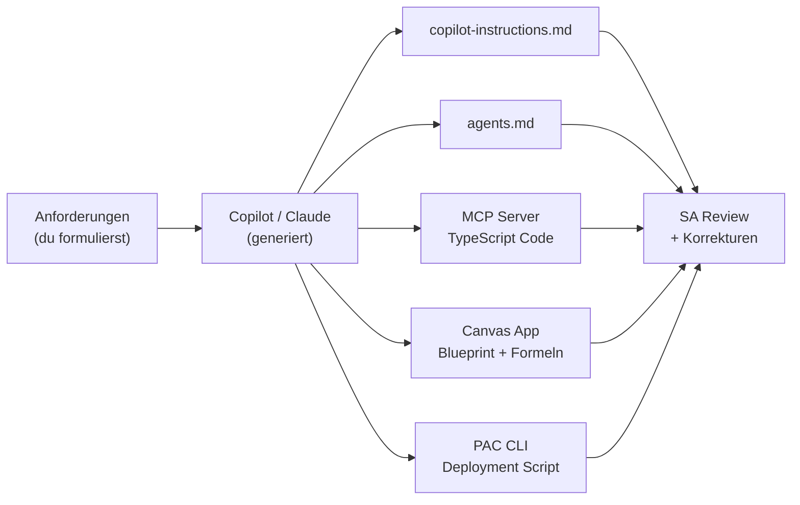

# Hands-On M09 — Agentic: VisitTrack AI System mit Agent Mode bauen

> **Typ:** Agentic Build Session — der AI-Editor übernimmt den ersten Entwurf
> **Dauer:** ca. 90 Minuten
> **Werkzeuge:** VS Code Copilot Agent Mode, Claude Code (alternativ)
> **Voraussetzung:** `copilot-instructions.md` aus Aufgabe 0.1 im Workspace

---

## Szenario: Der SA als AI-gestützter Builder

Du hast die Konzepte aus 0901 und 0904 kennengelernt. Jetzt wendest du sie in einem Durchgang an: Du baust das VisitTrack KI-System indem du **den AI-Editor als Hauptgenerator** nutzt — du gibst Anforderungen, prüfst und korrigierst Ergebnisse.



---

## Aufgabe 1: Workspace mit einem Prompt einrichten (15 Minuten)

**Ziel:** Copilot-Kontext in einem Schritt aufbauen — ohne die Vorlage zu kopieren.

Schicke diesen Prompt an Copilot Chat (Agent Mode aktivieren: `@workspace`):

```
Erstelle für mich eine .github/copilot-instructions.md für das VisitTrack-Projekt.

Projektrahmenbedingungen:
- Kunde: MedPharma GmbH
- Lösung: Power Platform (Canvas Apps, Dataverse, Power Automate, Copilot Studio)
- Zielgruppen: 200 ADMs (mobil), 6 Manager (Desktop), SA, Admin
- ALM: PAC CLI, GitHub Actions, 3 Umgebungen (DEV/TEST/PROD)
- Tabellenpräfix: vt_, Publisher: medpharma
- Power Fx: gbl/loc/col Naming, Controls: btnX/lblX/galX/frmX/txtX
- Offline-Anforderung: ADMs müssen Besuche auch ohne Verbindung erfassen können

Copilot soll bei jeder Antwort: Lizenzkosten erwähnen wenn relevant,
Service Protection Limits warnen, Offline-Szenarien kennzeichnen.
Diagramme immer als Mermaid.
```

**Review-Checkliste:**

- [ ] Tabellenpräfix `vt_` enthalten?
- [ ] Offline-Anforderung explizit erwähnt?
- [ ] Power Fx Naming-Konvention vollständig?
- [ ] Stack vollständig (alle 4 Komponenten)?

Korrigiere was fehlt und speichere die Datei.

---

## Aufgabe 2: agents.md mit Copilot generieren (10 Minuten)

```
Erstelle eine agents.md für den VisitTrack SA-Workspace.

Ich brauche 4 Agents:
1. schema-agent — Dataverse Datenmodell (Tabellen, Beziehungen, RLS)
   Darf nicht: direkt deployen
2. requirement-analyst — Fit/Gap-Analyse, User Stories, Lizenzschätzung
   Darf nicht: Implementierungsdetails ohne klare Anforderung
3. review-agent — Architecture Review nach Checkliste (Naming, Security, ALM, Limits)
   Darf nicht: Dateien direkt ändern
4. pac-cli-agent — PowerShell/PAC CLI Deployment Scripts generieren
   Darf nicht: Production-Deployment ohne expliziten Review-Hinweis

Format je Agent: System-Anweisung (3 Sätze), 3 Beispiel-Prompts, Output-Format.
```

Prüfe: Sind die Einschränkungen (`Darf nicht`) explizit im System Prompt jedes Agents?

---

## Aufgabe 3: MCP Server Code generieren (25 Minuten)

**Ziel:** Copilot schreibt den MCP Server — du reviewst und korrigierst.

### Schritt 3.1 — Projektgerüst

```
Erstelle das Projektgerüst für einen MCP Server "visittrack-mcp-server".

Stack: Node.js, TypeScript, @modelcontextprotocol/sdk, zod
Setup-Kommandos: npm init, install, tsconfig.json, src/index.ts

Generiere auch eine .vscode/mcp.json die den Server als stdio-MCP einbindet.
```

### Schritt 3.2 — Tools implementieren

```
Implementiere 4 MCP Tools in src/index.ts für VisitTrack:

1. get_visits(adm_user_id: string, date_from?: string, limit?: number)
   → Gibt Visit-Liste zurück (Mock-Daten ok)

2. get_physician(name: string)
   → Sucht Arzt per Name, gibt Physician-Objekt oder null zurück

3. create_visit(physician_id: string, visit_date: string, duration_minutes?: number)
   → Legt Besuch an, gibt {visit_id, status} zurück

4. get_performance_summary(adm_user_id: string, period_days: number)
   → Gibt {total_visits, avg_duration, top_physicians} zurück

Nutze realistische Mock-Daten (3-5 Einträge pro Arzt).
```

### Schritt 3.3 — Tests

```
Schreibe vitest-Tests für alle 4 Tools.
Mindestens 2 Tests pro Tool (Happy Path + Edge Case).
Importiere den Server-Code direkt ohne HTTP — teste Tool-Handler direkt.
```

**Review vor Übernahme:**

- Sind Input-Validierungen mit zod vollständig?
- Gibt jeder Tool-Handler das korrekte `{ content: [{ type: "text", text: ... }] }` Format zurück?
- Laufen die Tests: `npx vitest run`?

---

## Aufgabe 4: Canvas App Blueprint und Formeln generieren (25 Minuten)

### Schritt 4.1 — App Blueprint

```
Erstelle einen vollständigen App-Blueprint für die VisitTrack Canvas App.

Anforderungen:
- Zielgruppe: ADMs auf Mobilgeräten (Touch-optimiert)
- Datenquellen: Dataverse vt_visits, vt_physicians
- Kernaufgaben: Besuche ansehen, neuen Besuch anlegen, Arzt suchen
- Offline-Anforderung: Besuche erfassen auch ohne Verbindung (lokale Collection)

Output:
1. Mermaid flowchart — Screen-Navigation
2. Tabelle: Screen | Controls (Name, Typ) | Offline-fähig?
3. Power Fx OnStart: Daten laden + Verbindung prüfen
```

### Schritt 4.2 — Kritische Formeln

```
Schreibe die folgenden Power Fx Formeln für VisitTrack:

A) Items-Formel für galVisits:
   - Filtere vt_visits nach aktuellem Nutzer (vt_owner = User().Email)
   - Sortiert nach vt_visit_date absteigend
   - Offline-Fallback: colOfflineVisits

B) OnSelect für btnSaveVisit:
   - Validierung: drpPhysician.Selected nicht leer, vt_visit_date nicht in Zukunft
   - Online: Patch() in vt_visits mit IfError()
   - Offline: Collect() in colOfflineVisits mit _offlinePending: true
   - Notify() + Navigate() je nach Ergebnis

Konventionen: gbl/loc/col Präfixe, btnX/galX Control-Namen, vt_ Tabellenpräfix
```

**Pflichtprüfung:**

- `StartsWith` statt `Contains` für Delegation? (Prüfe Formel A)
- `IfError()` um `Patch()` herum? (Prüfe Formel B)

---

## Aufgabe 5: Deployment Script generieren (15 Minuten)

```
Generiere ein PowerShell-Script für das VisitTrack Deployment:

1. pac auth create für DEV ($DEV_ENV) und TEST ($TEST_ENV)
2. Solution "VisitTrack" (Publisher: medpharma) aus DEV als Unmanaged exportieren
3. Als Managed Solution in TEST importieren mit --publish-changes
4. Bei jedem Fehler: Script abbricht ($ErrorActionPreference = "Stop")
5. Log-Ausgabe mit Write-Host für jeden Schritt

Variablen als Block am Anfang des Scripts.
Kommentiere jeden Abschnitt.
Füge am Ende einen Hinweis ein: PRODUCTION REVIEW REQUIRED.
```

Prüfe: Enthält das Script den `PRODUCTION REVIEW REQUIRED`-Hinweis?

---

## Abschluss-Review (5 Minuten)

Gehe alle generierten Artefakte durch und beantworte:

| Artefakt                | AI hat generiert | SA hat korrigiert |
| ----------------------- | ---------------- | ----------------- |
| copilot-instructions.md |                  |                   |
| agents.md               |                  |                   |
| MCP Server src/index.ts |                  |                   |
| vitest Tests            |                  |                   |
| Canvas App Blueprint    |                  |                   |
| Power Fx Formeln        |                  |                   |
| PAC CLI Deploy Script   |                  |                   |

**Reflexionsfragen:**

1. Bei welchem Artefakt war die AI-Ausgabe am nützlichsten?
2. Wo musstest du am meisten korrigieren — und warum?
3. Was hättest du ohne AI-Unterstützung länger gebraucht?
