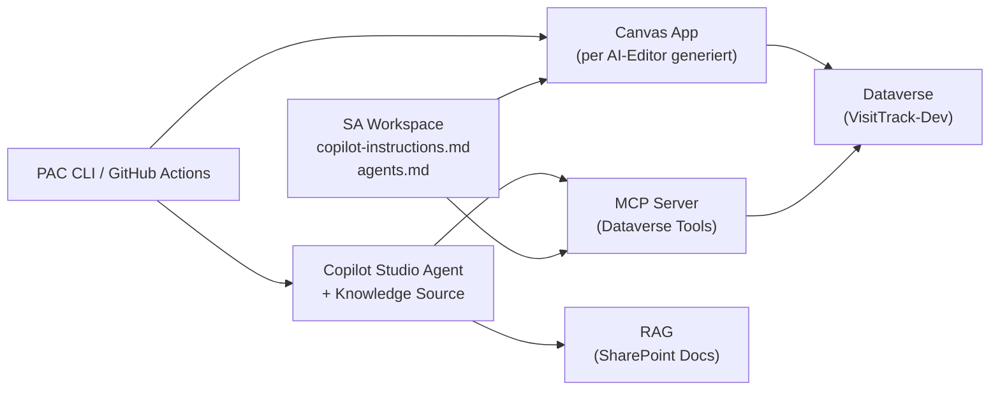

# Hands-on M09 — Agentic AI & MCP: VisitTrack KI-System

> **Typ:** End-to-End Entwicklung — SA Workspace, MCP Server, RAG, Canvas App per AI-Editor, Deployment
> **Dauer:** ca. 4 Stunden (aufgeteilt auf Tag 2 Nachmittag + Tag 3 Vormittag)
> **Lösung:** siehe `hands-on-sol.md`

---

## Gesamtziel

Du richtest als SA deinen AI-gestützten Workspace ein und baust das **VisitTrack KI-System**:



---

## Phase 0: SA Workspace einrichten (20 Minuten)

Bevor du Code schreibst, gibst du Copilot den Projektkontext — einmal, dauerhaft.

### 0.1 copilot-instructions.md anlegen

Erstelle `.github/copilot-instructions.md` im Workspace-Root (Referenz: `0901-agentic-ai-konzepte/copilot-instructions.md`):

```markdown
# Projekt: VisitTrack — Power Platform Solution Architecture

## Kontext

Solution Architect bei MedPharma GmbH. Power Platform Projekt.
Stack: Canvas Apps, Dataverse, Power Automate, Copilot Studio, PAC CLI.

## Konventionen

- Tabellenpräfix: vt\_ (Publisher: medpharma)
- Power Fx: gbl* globals, loc* locals, col\* collections
- Controls: btnX, lblX, galX, frmX, txtX
- Diagramme: immer Mermaid

## Arbeitsweise

- Lizenzimplikationen bei jeder Empfehlung erwähnen
- Service Protection Limits beim Dataverse Web API immer berücksichtigen
- Offline-Szenarien explizit kennzeichnen
```

### 0.2 Workspace-Test

Öffne Copilot Chat und frage **ohne weiteren Kontext**:

```
"Schlage eine Tabellenstruktur für Arztbesuche vor"
```

✓ Prüfe: Verwendet Copilot automatisch `vt_`-Präfix und Mermaid?

### 0.3 agents.md anlegen

Erstelle `agents.md` im Workspace-Root (Referenz: `0901-agentic-ai-konzepte/agents.md`). Nimm mindestens den `schema-agent` und den `pac-cli-agent` mit.

---

## Phase 1: MCP Server (60 Minuten)

### 1.1 Projekt aufsetzen

```bash
mkdir visittrack-mcp-server && cd visittrack-mcp-server
npm init -y
npm install @modelcontextprotocol/sdk zod
npm install -D typescript @types/node tsx vitest
```

### 1.2 Tools implementieren

Implementiere 4 Tools (Mock-Daten sind ok):

| Tool                      | Input                               | Output                                       |
| ------------------------- | ----------------------------------- | -------------------------------------------- |
| `get_visits`              | adm_user_id, date_from?, limit?     | Visit-Liste                                  |
| `get_physician`           | name                                | Physician oder null                          |
| `create_visit`            | physician_id, visit_date, duration? | {visit_id, status}                           |
| `get_performance_summary` | adm_user_id, period_days            | {total_visits, avg_duration, top_physicians} |

### 1.3 Tests schreiben

Mindestens 8 Tests (2 pro Tool). Führe `npx vitest` aus.

### 1.4 VS Code integration

Erstelle `.vscode/mcp.json` und teste einen Tool-Aufruf direkt im Copilot Chat.

---

## Phase 2: RAG — Knowledge Source für Copilot Studio (30 Minuten)

### 2.1 Knowledge Base vorbereiten

Erstelle einen SharePoint-Ordner (oder lokal für den MCP-Test) mit mindestens 3 Markdown-Dateien:

```
knowledge-base/
  products.md      # 5 fiktive MedPharma Produkte mit Beschreibung und Indikationen
  compliance.md    # 5 Compliance-Regeln für Arztbesuche
  visit-process.md # Ablauf eines Arztbesuchs (Onboarding-Material)
```

### 2.2 Copilot Studio Knowledge Source einrichten

Öffne deinen `VisitTrack KI-Assistent` Agent in Copilot Studio:

```
+ Knowledge → "Upload files" (oder SharePoint-URL)
→ Die 3 Markdown-Dateien auswählen
→ Copilot Studio chunked + embeddet automatisch
```

### 2.3 System Prompt schreiben

Ergänze den Agent-System-Prompt so, dass er:

- Nur aus der Knowledge Base antwortet
- Bei fehlenden Infos "weiß ich nicht" sagt (kein Raten)
- Jede Aussage mit Quelle belegt: `(Quelle: [Dokumentname])`

### 2.4 Knowledge testen

Stelle 3 Fragen die in den Dokumenten beantwortet werden können, und 2 Fragen die **nicht** beantwortet werden dürfen (Out-of-Scope). Dokumentiere das Ergebnis.

> **Optional — lokaler MCP RAG Server**: Falls kein Copilot Studio verfügbar ist, baue einen zweiten MCP Server `visittrack-rag-mcp` mit dem Tool `search_knowledge` der die lokalen Markdown-Dateien per Keyword-Search durchsucht (siehe `0902-mcp-entwicklung` für das Muster).

---

## Phase 3: Copilot Studio Agent (45 Minuten)

### 3.1 Agent erstellen

Erstelle in VisitTrack-Dev einen neuen Agent `VisitTrack KI-Assistent`.

### 3.2 Topics konfigurieren

Erstelle 3 Topics:

**Topic 1: Besuche abfragen**

- Trigger: "Was habe ich heute?", "Meine Besuche", "Visit-Übersicht"
- Action: MCP get_visits aufrufen (falls nicht via MCP: Power Automate Flow)
- Response: Strukturierte Liste

**Topic 2: Wissensfrage**

- Trigger: "Was ist...", "Wie funktioniert...", "Compliance"
- Action: search_knowledge aufrufen
- Response: Antwort mit Quellenangabe

**Topic 3: Performance-Analyse**

- Trigger: "Meine Performance", "Wie war diese Woche?", "Statistik"
- Action: get_performance_summary
- Response: Zusammenfassung mit Trends

### 3.3 Agent testen

Teste mindestens 5 Gespräche. Dokumentiere was gut/schlecht funktioniert.

---

## Phase 4: Canvas App per AI-Editor bauen (45 Minuten)

Du baust die VisitTrack Canvas App nicht manuell — du nutzt Copilot oder Claude Code als ersten Entwurfs-Generator (→ Details in `0904-canvas-apps-mit-ki`).

### 4.1 App-Blueprint generieren

Schicke folgenden Prompt an Copilot Chat (oder Claude):

```
Du bist ein Power Apps Architekt.

Erstelle einen App-Blueprint für VisitTrack:
- Zielgruppe: Außendienstmitarbeiter (ADM) auf Mobilgeräten
- Datenquelle: Dataverse (vt_visits, vt_physicians)
- Kernaufgaben: Besuche ansehen, neuen Besuch anlegen, Arzt suchen
- Anforderungen: Offline-fähig, Touch-optimiert

Output:
1. Screen-Liste mit Zweck je Screen (Mermaid flowchart)
2. Controls je Screen (Tabelle: Name | Typ | Zweck)
3. Navigationsfluss
4. Welche Screens sind offline-fähig, welche nicht
```

Review das Ergebnis — passe fehlende Screens oder Controls an.

### 4.2 Power Fx Formeln generieren lassen

Lass Copilot/Claude die Items-Formel für die Visit-Gallery generieren:

```
"Schreibe die Items-Formel für eine Gallery die nur Besuche des aktuellen Nutzers
 aus vt_visits anzeigt, sortiert nach vt_visit_date absteigend,
 mit Offline-Fallback auf colOfflineVisits."
```

**Pflichtprüfung vor Übernahme:**

- Delegation-Warning? (`StartsWith` ✓, `Contains` ✗)
- Offline-Zweig vollständig?
- Fehlerhandling beim `Patch()`?

### 4.3 PAC CLI-Script generieren lassen

```
"Generiere ein PowerShell-Script das die VisitTrack Solution aus DEV exportiert
 (Unmanaged) und als Managed Solution in TEST importiert.
 Variablen: $DEV_ENV, $TEST_ENV. Publisher: medpharma."
```

Prüfe das Script auf: Managed/Unmanaged korrekt unterschieden? `--publish-changes` vorhanden?

---

## Phase 5: Deployment & Abschluss (30 Minuten)

### 5.1 agents.md vervollständigen

Ergänze deine `agents.md` (aus Phase 0) um die MCP Server Konfiguration:

```markdown
## MCP Server Konfiguration

### visittrack-dataverse

- **Typ:** stdio
- **Command:** `node ./visittrack-mcp-server/dist/index.js`
- **Umgebungsvariablen:** DATAVERSE_URL, TENANT_ID (aus .env)

### visittrack-rag (optional)

- **Typ:** stdio
- **Command:** `node ./visittrack-rag-mcp/dist/index.js`
- **Umgebungsvariablen:** KB_PATH=./knowledge-base
```

### 5.2 GitHub Actions Workflow

Erstelle `.github/workflows/deploy.yml`:

- Trigger: Push auf `main` bei Änderungen in `visittrack-mcp-server/**` oder `agents.md`
- Job `test`: `npm test` im MCP-Server-Verzeichnis
- Job `deploy`: PAC CLI Solution Import in TEST (verwende das Script aus Phase 4.3)

### 5.3 Monitoring Plan

Definiere 5 KPIs die du in Production monitoren würdest (z.B. MCP Tool-Aufruf-Fehler, Agent-Antwortqualität, Knowledge-Quelle-Trefferquote).

---

## Checkpoint ✓

**Phase 0 — SA Workspace:**

- [ ] `.github/copilot-instructions.md` vorhanden, Copilot nutzt `vt_`-Präfix automatisch
- [ ] `agents.md` mit mindestens `schema-agent` und `pac-cli-agent`

**Phase 1 — MCP Server:**

- [ ] MCP Server mit 4 Tools läuft (`get_visits`, `get_physician`, `create_visit`, `get_performance_summary`)
- [ ] 8 Tests bestehen (`npx vitest`)
- [ ] `.vscode/mcp.json` vorhanden, Tool-Aufruf via Copilot Chat funktioniert

**Phase 2 — RAG:**

- [ ] Knowledge Base mit 3 Markdown-Dateien
- [ ] Copilot Studio Knowledge Source eingerichtet
- [ ] System Prompt: In-Scope-Fragen beantwortet, Out-of-Scope-Fragen abgelehnt

**Phase 3 — Agent:**

- [ ] Copilot Studio Agent mit 3 Topics
- [ ] 5 Testgespräche dokumentiert

**Phase 4 — Canvas App:**

- [ ] App-Blueprint via Prompt generiert und reviewed
- [ ] Mindestens eine Power Fx-Formel generiert und auf Delegation geprüft
- [ ] PAC CLI-Script generiert und auf Managed/Unmanaged geprüft

**Phase 5 — Deployment:**

- [ ] `agents.md` mit MCP Server Konfiguration vollständig
- [ ] GitHub Actions Workflow vorhanden
