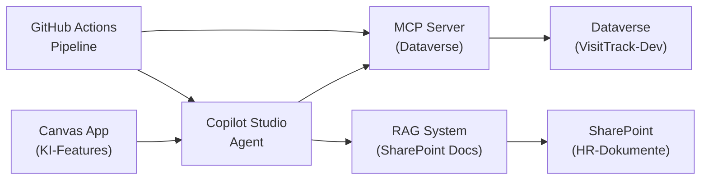

# Hands-on M09 — Agentic AI & MCP: VisitTrack KI-System

> **Typ:** End-to-End Entwicklung — MCP Server, Agent, RAG, Deployment
> **Dauer:** ca. 4 Stunden (aufgeteilt auf Tag 2 Nachmittag + Tag 3 Vormittag)
> **Lösung:** siehe `hands-on-sol.md`

---

## Gesamtziel

Du baust das **VisitTrack KI-System** von Grund auf:



---

## Phase 1: MCP Server (60 Minuten)

### 1.1 Projekt aufsetzen

```bash
mkdir visittrack-mcp-server && cd visittrack-mcp-server
npm init -y
npm install @modelcontextprotocol/sdk zod
npm install -D typescript @types/node tsx vitest
```

### 1.2 Tools implementieren

Implementiere 4 Tools (Mock-Daten sind ok):

| Tool                      | Input                               | Output                                       |
| ------------------------- | ----------------------------------- | -------------------------------------------- |
| `get_visits`              | adm_user_id, date_from?, limit?     | Visit-Liste                                  |
| `get_physician`           | name                                | Physician oder null                          |
| `create_visit`            | physician_id, visit_date, duration? | {visit_id, status}                           |
| `get_performance_summary` | adm_user_id, period_days            | {total_visits, avg_duration, top_physicians} |

### 1.3 Tests schreiben

Mindestens 8 Tests (2 pro Tool). Führe `npx vitest` aus.

### 1.4 VS Code integration

Erstelle `.vscode/mcp.json` und teste einen Tool-Aufruf direkt im Copilot Chat.

---

## Phase 2: RAG System (45 Minuten)

### 2.1 Knowledge Base vorbereiten

Erstelle eine lokale Knowledge Base (`./knowledge-base/`) mit mindestens 3 Markdown-Dateien:

```
knowledge-base/
  products.md          # 5 fiktive MedPharma Produkte mit Beschreibung
  compliance.md        # 5 Compliance-Regeln für Arztbesuche
  visit-process.md     # Ablauf eines Arztbesuchs (Onboarding-Material)
```

### 2.2 RAG MCP Server

Baue einen zweiten MCP Server `visittrack-rag-mcp` mit dem Tool `search_knowledge`:

```typescript
server.tool(
  "search_knowledge",
  "Sucht in der VisitTrack Wissensdatenbank nach relevanten Informationen",
  {
    query: z.string().describe("Suchanfrage in natürlicher Sprache"),
    category: z
      .enum(["products", "compliance", "process", "all"])
      .default("all"),
  },
  async ({ query, category }) => {
    // Einfache Keyword-Suche in den MD-Dateien
    // (Ersetze später durch echtes Vector Search)
    const results = await keywordSearch(query, category);
    return { content: [{ type: "text", text: JSON.stringify(results) }] };
  }
);
```

Für Keyword-Search kannst du einfach `String.includes()` nutzen — das ist kein echtes RAG, aber zeigt das Pattern.

### 2.3 System Prompt gegen Halluzinationen

Schreibe einen System Prompt der:

- Agent auf Knowledge Base beschränkt
- "Weiß nicht" erlaubt
- Quellenangaben erzwingt

---

## Phase 3: Copilot Studio Agent (45 Minuten)

### 3.1 Agent erstellen

Erstelle in VisitTrack-Dev einen neuen Agent `VisitTrack KI-Assistent`.

### 3.2 Topics konfigurieren

Erstelle 3 Topics:

**Topic 1: Besuche abfragen**

- Trigger: "Was habe ich heute?", "Meine Besuche", "Visit-Übersicht"
- Action: MCP get_visits aufrufen (falls nicht via MCP: Power Automate Flow)
- Response: Strukturierte Liste

**Topic 2: Wissensfrage**

- Trigger: "Was ist...", "Wie funktioniert...", "Compliance"
- Action: search_knowledge aufrufen
- Response: Antwort mit Quellenangabe

**Topic 3: Performance-Analyse**

- Trigger: "Meine Performance", "Wie war diese Woche?", "Statistik"
- Action: get_performance_summary
- Response: Zusammenfassung mit Trends

### 3.3 Agent testen

Teste mindestens 5 Gespräche. Dokumentiere was gut/schlecht funktioniert.

---

## Phase 4: Canvas App Integration (45 Minuten)

### 4.1 Agent in Canvas App einbetten

Öffne deine VisitTrack Canvas App (aus M03/M04) und:

1. Füge ein Copilot Chat Panel hinzu (rechte Seite)
2. Verbinde mit `VisitTrack KI-Assistent`
3. Übergib Kontext: aktuell ausgewählter Arzt + Besuch

### 4.2 KI-Feature: Besuchsnotizen zusammenfassen

Füge in der Besuchs-Detailansicht hinzu:

- Button "Notiz zusammenfassen"
- `OnSelect`: `Set(summary, Summarize(visitNotes, "2 Sätze"))`
- Label: Zeige `summary` an

### 4.3 Offline Handling

Verstecke alle KI-Features wenn `!Connection.Connected`.

---

## Phase 5: Deployment & agents.md (30 Minuten)

### 5.1 agents.md erstellen

Erstelle `agents.md` im Repository-Root:

- Beide Agents (Assistent + zukünftiger Architect-Agent)
- Beide MCP Server (dataverse + rag)
- Alle Environment-Variablen referenziert

### 5.2 GitHub Actions Workflow

Erstelle `.github/workflows/deploy.yml`:

- Trigger bei Änderungen in `mcp-servers/**` oder `agents.md`
- Job: Tests
- Job: Deploy (Pseudocode wenn kein echter Tenant)

### 5.3 Monitoring Plan

Definiere 5 KPIs die du in Production monitoren würdest.

---

## Checkpoint ✓

- [ ] MCP Server mit 4 Tools + 8 Tests läuft
- [ ] VS Code Tool-Aufruf via Copilot Chat funktioniert
- [ ] Knowledge Base mit 3 Dateien
- [ ] RAG MCP Server mit `search_knowledge` Tool
- [ ] Copilot Studio Agent mit 3 Topics
- [ ] Agent-Test: 5 Gespräche dokumentiert
- [ ] Canvas App mit Copilot Panel
- [ ] Offline Handling implementiert
- [ ] `agents.md` vollständig
- [ ] GitHub Actions Workflow erstellt
